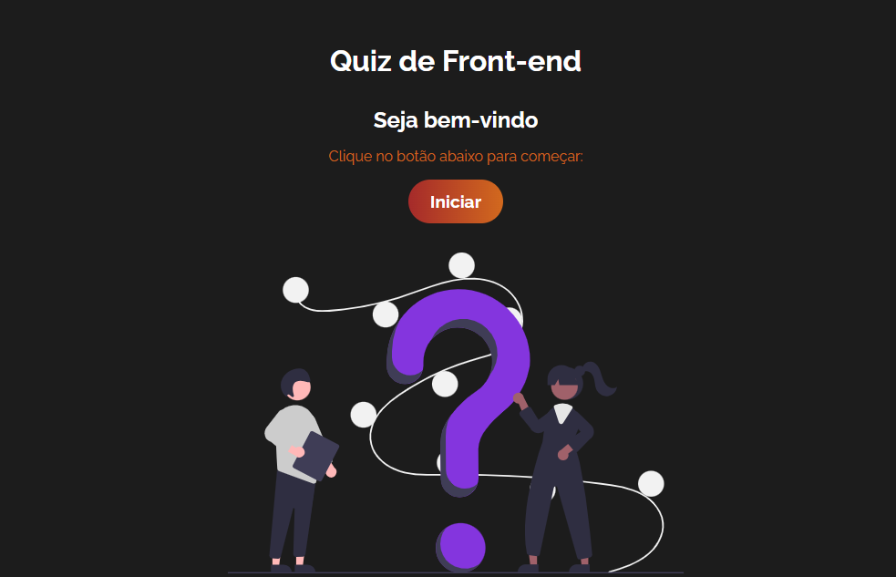
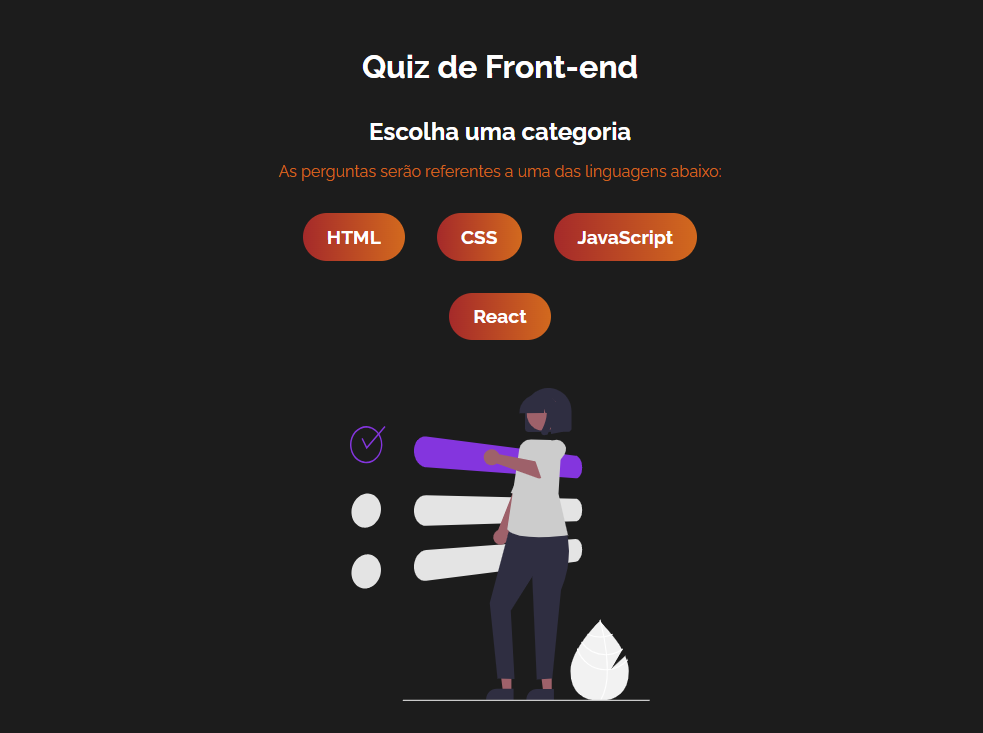
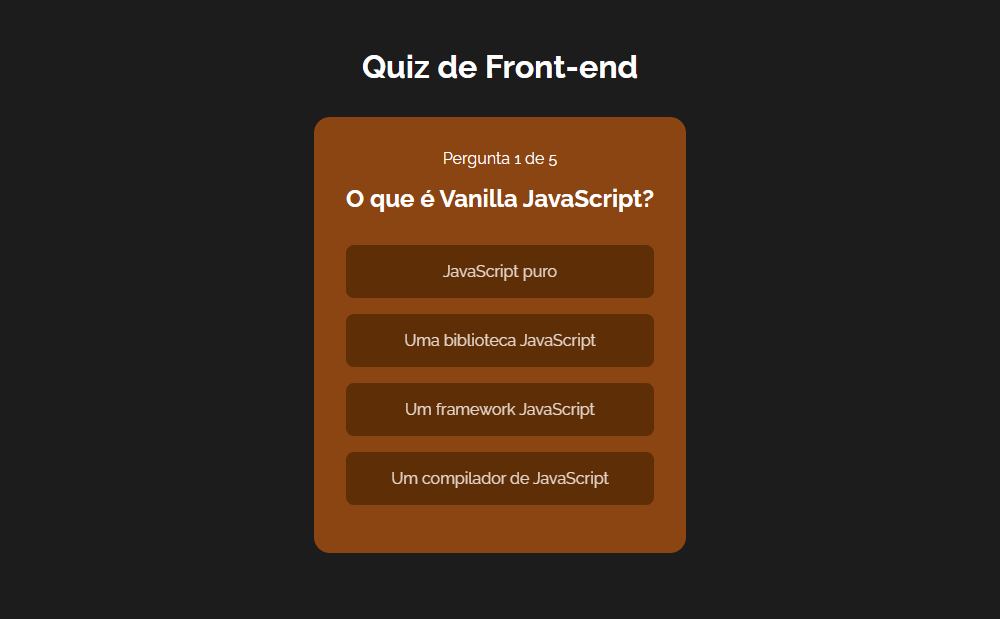
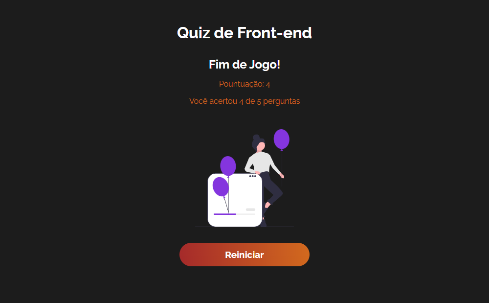

# Quiz Front-end

Um quiz de front-end com perguntas sobre HTML, CSS, JavaScript e React.

## índice
- <a href="#funcionalidades">Funcionalidades do projeto</a>
- <a href="#layout">Layout</a>
- <a href="#tecnologias">Tecnologias utilizada</a>
- <a href="#autoras">Pessoas autoras</a>

## 💻 Funcionalidades do projeto

- [x] Escolha de categoria
- [x] Embaralhamento das questões
- [x] Opção de dica para ajudar nas perguntas
- [x] Visualização da pontuação do usuário
- [x] Botão de reiniciar o quiz

## Layout

### Tela inicial

### Tela de escolha de categoria

### Tela de perguntas

### Tela de fim de jogo

## Tecnologias utilizadas
1. [React](https://react.dev/)